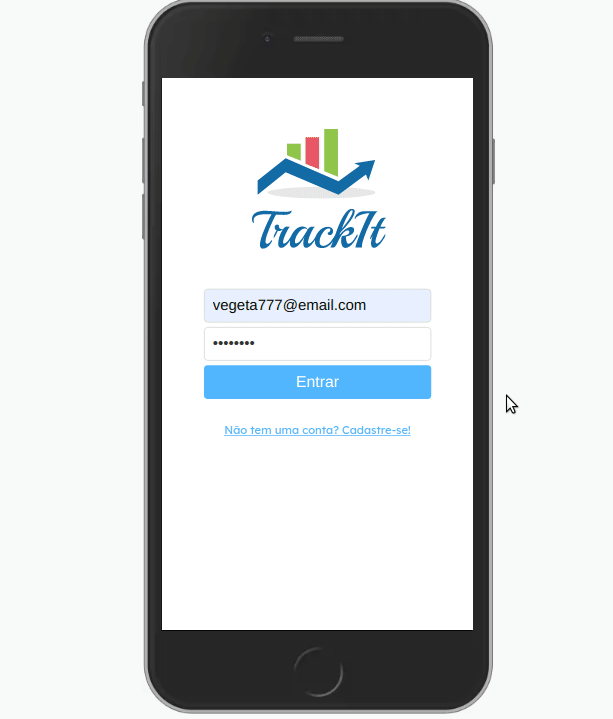

<h1 align="center">Track It</h1>

<h1 align="center">
  </img>
</h1>

## 🔖 Sobre

Aplicação para gestão de hábitos. Você pode cadastrar e escolher em quais dias da semana irá realizar cada hábito e o aplicativo irá te mostrar a lista de hábitos para o dia atual para que você possa marcar todos os que forem sendo realizados.

Clique [aqui](https://trackit-lilac.vercel.app/hoje) para conferir, crie sua conta com um email genérico e comece a rastrear seus hábitos :)

## 🛠 Tecnologias utilizadas

O projeto foi desenvolvido usando as seguintes tecnologias:

- [ReactJS](https://reactjs.org)
- [Styled Components](https://styled-components.com/)
- [Axios](https://www.npmjs.com/package/axios)

## 📦 Como baixar o projeto e rodar localmente

```bash

  # Clonar repositório
  $ git clone https://github.com/samuelfcf/trackit

  # Entrar no diretório
  $ cd trackit

  # Instalar dependências
  $ yarn install

  # Iniciar o projeto
  $ yarn start
```

---

Desenvolvido por Samuel Felipe Castro Fernandes
